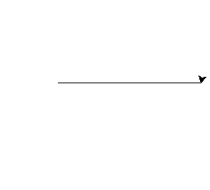

# Computação Gráfica - Estrela ⭐

<f2 align = "left"> **O seguinte projeto possui o objetivo de construir uma estrela por meio de conhecimentos com fractal.**</f2> 

 

# Importando o módulo Turtle

Para utilizar um módulo no Python, utilizamos o comando import (importar) seguido do nome do módulo que queremos importar. Após a importação, já podemos utilizar todos os objetos e funções que o módulo disponibiliza.
   
  
    import turtle

Em seguida, para criar uma tela chamada "estrela" use a função:
   
  
    estrela = turtle.Screen()
  

 Logo, ele cria um objeto tartaruga chamado "geekyTurtle" usando a função: 

    geekyTurtle = turtle.Turtle()

 Assim, o código entra em um loop for que será executado cinco vezes (para os cinco pontos da estrela). Dentro do loop, a tartaruga avança 200 pixels usando o método forward() e, em seguida, vira 144 graus para a direita usando o método right(). A tartaruga continuará avançando e virando à direita até completar uma estrela de cinco pontas completa.

  
    for i in range(5):
        geekyTurtle.forward(200)

        geekyTurtle.right(144)

 Por fim, o código finaliza a janela gráfica da tartaruga chamando a função:

    turtle.done();
